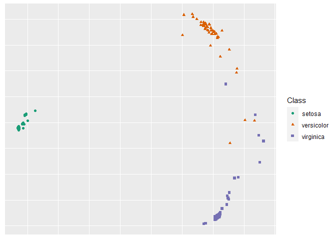

README.rmd
================
Jake S. Rhodes
2/9/2022

# RF-GAP

## Random Forest Geometry- and Accuracy-Preserving proximities

This is the official repository for the papr “Random Forest- Geometry-
and Accuracy-Preserving Proximities”
(<https://arxiv.org/abs/2201.12682>). In the paper we show that random
forest (RF) predictions can be exactly determined by using RF-GAP
proximities as weights in a weighted-sum regressor or weighted-majority
vote classifier. This repo provides the base code to generate the
various proximity definitions described in the paper. We provide some
examples below.

## Generate RF-GAP proximities:

``` r
library(rfgap)

x <- iris[, 1:4]
y <- iris[, 5]
prox <- get_proximities(x, y, type = 'rfgap')
```

## Create 2-dimensional MDS embedding and plot

``` r
x <- iris[, 1:4]
y <- iris[, 5]
mds <- rf_mds(x, y, type = 'rfgap')
```

    ## initial  value 16.345392 
    ## iter   5 value 8.179526
    ## iter  10 value 7.689686
    ## final  value 7.676416 
    ## converged

``` r
plot(mds, y)
```

<!-- -->

## Impute missing data

``` r
x <- airquality[, -4]
y <- airquality[, 4]
imputed_data <- rf_impute(x, y, type = 'rfgap')
```

## Run Outlier Detection

``` r
x <- mtcars[, -c(1, 2)]
y <- as.factor(mtcars[, 2])
outlier_scores <- rf_outliers(x, y, type = 'rfgap')

plot(outlier_scores, x, y)
```

    ## initial  value 15.309086 
    ## iter   5 value 12.517240
    ## iter  10 value 11.569765
    ## iter  15 value 11.335294
    ## final  value 11.251275 
    ## converged

<!-- -->
